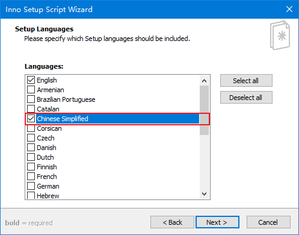

# Inno Setup Chinese Simplified Translation #
Inno Setup 简体中文翻译

[](https://github.com/kira-96/Inno-Setup-Chinese-Simplified-Translation/issues)
[](https://github.com/kira-96/Inno-Setup-Chinese-Simplified-Translation/network)
[](https://github.com/kira-96/Inno-Setup-Chinese-Simplified-Translation/stargazers)
[](https://github.com/kira-96/Inno-Setup-Chinese-Simplified-Translation)

## 食用方法 ##

- **Step 1**

  将**ChineseSimplified.isl**放到**Inno Setup安装目录**下的"Languages"文件夹里面

- **Step 2**

  如果你是通过新建脚本的方式创建脚本，在**Languages**选项勾选**Chinese Simplified**即可：

  

  如果你需要在现有脚本中添加简体中文支持
  直接在你的脚本的`[Languages]`部分添加下面一行即可

  ``` yaml
  Name: "chinesesimplified"; MessagesFile: "compiler:Languages\ChineseSimplified.isl"
  ```

  示例：

  ``` yaml
  [Languages]
  Name: "english"; MessagesFile: "compiler:Default.isl"
  Name: "chinesesimplified"; MessagesFile: "compiler:Languages\ChineseSimplified.isl"
  ```

**注意：此翻译版本支持 Inno Setup 5.5.3+ 的软件**

因为有好多人来问我要5.x版本的翻译，所以这里就提供了一份，我也没有做过完整的测试。有问题请及时反馈。

### 链接 ###

- [Inno Setup](https://jrsoftware.org/isinfo.php)
- [issrc](https://github.com/jrsoftware/issrc)
